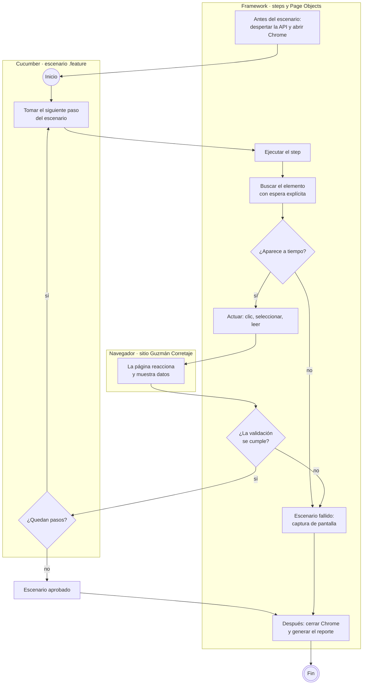
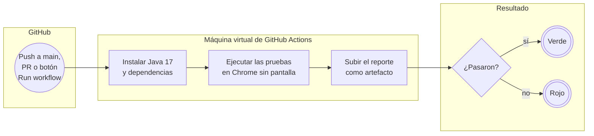

# Guzmán Corretaje — Automatización E2E con Selenium + Cucumber

> **Rama `main`** · Automatización base, **sin IA**. Ejemplo de cómo construir pruebas E2E con **Selenium 4**, **Cucumber 7** y **TestNG** bajo **Page Object Model**.

## ¿Qué hace esta rama?

Abre un navegador y hace **exactamente lo que haría un cliente** en el sitio [Guzmán Corretaje](https://guzman-corretaje.vercel.app/), comprobando en cada paso que la página responda como se espera:

1. Entra al home y elige **Comprar**.
2. Filtra por **Departamento**, **Región Metropolitana** y **Ñuñoa**, y presiona **Buscar**.
3. Revisa que el listado tenga resultados y que **todas** las propiedades estén en Ñuñoa.
4. Abre la primera propiedad y verifica que el detalle muestre **el mismo título, ubicación, precio y código** que la tarjeta del listado, además de dormitorios y baños.

Si algo no se cumple, la prueba falla y deja una **captura de pantalla** del momento exacto del error.

El escenario está escrito en lenguaje de negocio ([`busqueda_propiedad.feature`](src/test/resources/features/busqueda_propiedad.feature)):

```gherkin
Scenario: Buscar un departamento en venta en Ñuñoa y revisar su detalle
  Given que el usuario está en el home de Guzmán Corretaje
  When selecciona la operación "Comprar"
  And filtra por tipo "Departamento", región "Región Metropolitana" y comuna "Ñuñoa"
  And presiona Buscar
  Then ve el listado "Propiedades en Venta" con al menos 1 resultado
  ...
```

## Ramas del repositorio

Cada rama agrega un nivel sobre la anterior:

| Rama | Qué agrega | IA |
|---|---|---|
| **`main`** (esta) | Automatización base: Selenium + Cucumber + TestNG con Page Object Model | No |
| [`feature/self-healing-ia`](https://github.com/pgp-qa-automation-labs/poc-selenium-cucumber/tree/feature/self-healing-ia) | **Self-healing:** si un elemento de la página cambia, la IA lo encuentra, la prueba continúa y se propone un PR que corrige el código | Sí (consulta directa) |
| [`feature/agentes-ia`](https://github.com/pgp-qa-automation-labs/poc-selenium-cucumber/tree/feature/agentes-ia) | **Agente de triage:** cuando una prueba falla, un agente investiga la causa y crea un issue en GitHub, Jira o Azure DevOps | Sí (agente) |
| [`demo/locator-obsoleto`](https://github.com/pgp-qa-automation-labs/poc-selenium-cucumber/tree/demo/locator-obsoleto) | Rama de demostración del PR automático del self-healing | — |

## Cómo funciona

### 1. Flujo de la prueba

Cada paso del escenario pasa por el framework, que busca el elemento en la página (esperando a que aparezca), actúa sobre él y valida el resultado.



- **Esperas explícitas:** el framework espera hasta 10 s a que cada elemento aparezca, en lugar de pausas fijas. Así la prueba es rápida cuando el sitio responde rápido y tolera cuando tarda.
- **Despertar la API:** el backend de QA corre en un plan gratuito que se duerme. Antes de abrir el navegador se consulta la API hasta que responda, para que la prueba no falle por eso.

### 2. Flujo del pipeline (GitHub Actions)



## Paso a paso para usarlo

### En tu computador
1. **Instala** [Java 17](https://adoptium.net/), [Maven 3.9+](https://maven.apache.org/download.cgi), [Git](https://git-scm.com/) y Google Chrome. No necesitas descargar ChromeDriver: Selenium lo obtiene solo.
2. **Descarga el proyecto:**
   ```bash
   git clone https://github.com/pgp-qa-automation-labs/poc-selenium-cucumber.git
   cd poc-selenium-cucumber
   ```
3. **Ejecuta las pruebas** (se abrirá Chrome y verás la prueba avanzar sola):
   ```bash
   mvn test
   ```
4. **Revisa el resultado** abriendo en el navegador `target/cucumber-reports/cucumber.html`. Cada paso aparece en verde (aprobado) o rojo (fallido), con la captura de pantalla si algo falló.

### En GitHub, sin instalar nada
1. Entra a la pestaña **Actions** → **E2E Selenium Cucumber** → **Run workflow** → **Run workflow**.
2. Al terminar, abre la ejecución: verás si pasó (✅) o falló (❌) y en **Artifacts** podrás descargar el reporte.

### Opciones útiles
```bash
mvn test                              # ambiente qa (por defecto)
mvn test -Denv=dev                    # localhost (front :3000, API :5000)
mvn test -Denv=prod                   # producción (aún sin URL: falla con mensaje claro)
mvn test -Dbrowser.headless=true      # sin abrir ventana del navegador
mvn test -Dcucumber.filter.tags=@smoke
```

## Configuración

```
src/test/resources/config/
├── config.json               → valores comunes a todos los ambientes
└── environments/
    ├── env_dev.json          → localhost
    ├── env_qa.json           → QA (preproductivo)
    └── env_prod.json         → producción
```

- Los JSON contienen **solo datos**; cada `env_<env>.json` declara únicamente lo que cambia respecto de `config.json`.
- Toda la lógica (mezcla, reglas, overrides y validaciones) está en `ConfigReader.java`.
- Precedencia (el último gana): `config.json` → `env_<env>.json` → reglas por contexto (`CI=true` fuerza headless) → `-Dseccion.clave=valor`.
- **Ventana del navegador:** con navegador visible se maximiza; en headless (CI) usa el tamaño fijo `browser.windowWidth` × `browser.windowHeight`.

## Estructura

```
src/main/java/cl/guzman/automation/
├── config/        ConfigReader y EnvironmentConfig
├── driver/        DriverFactory y DriverManager (un navegador por hilo)
├── pages/         BasePage, HomePage, ResultadosPage, DetallePropiedadPage
├── components/    TarjetaPropiedad
├── model/         Propiedad
└── utils/         TextUtils, ScreenshotUtils, WarmUpUtils

src/test/java/cl/guzman/automation/
├── context/       TestContext (estado compartido entre steps, vía PicoContainer)
├── hooks/         Hooks (despertar API, abrir/cerrar navegador, captura al fallar)
├── runners/       TestRunner (TestNG)
└── steps/         NavegacionSteps, BusquedaPropiedadSteps, DetallePropiedadSteps

src/test/resources/features/   escenarios Gherkin (palabras clave en inglés, pasos en español)
```

## Notas
- Si tienes un `chromedriver.exe` antiguo en el PATH, Maven lo ignora (`SE_SKIP_DRIVER_IN_PATH=true` en el `pom.xml`). Si ejecutas desde el IDE sin Maven, define esa variable de entorno en la configuración de ejecución.
