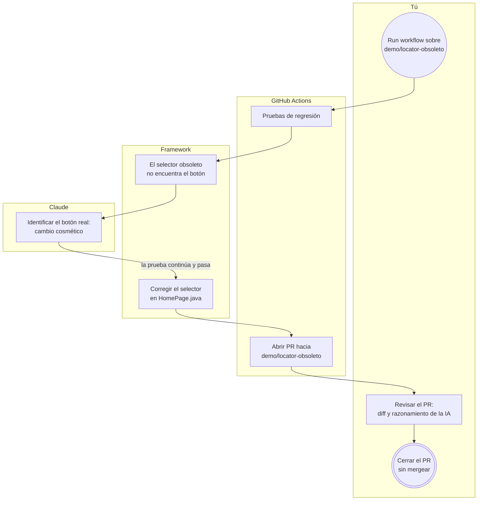

# Demo: PR automático del self-healing

> **Rama `demo/locator-obsoleto`** · Rama de **demostración**. Es una copia de [`feature/self-healing-ia`](https://github.com/pgp-qa-automation-labs/poc-selenium-cucumber/tree/feature/self-healing-ia) con **un error a propósito**: el selector del botón Buscar está desactualizado. **No se debe mergear.**

## ¿Para qué existe?

Para mostrar, en un caso real y reproducible, el ciclo completo del self-healing **sin tocar el sitio**:

1. En [`HomePage.java`](src/main/java/cl/guzman/automation/pages/HomePage.java) el botón Buscar se busca con `.buscador-hero__boton`, una clase que **no existe** en el sitio. Es como si el equipo de front la hubiera renombrado y el código de las pruebas hubiera quedado viejo.
2. Al ejecutar las pruebas, el selector falla, la **IA encuentra el botón real** y la prueba **pasa igual**.
3. El pipeline detecta que fue una reparación **real** (no simulada), corrige la línea en `HomePage.java` y **abre un Pull Request** con la corrección y el razonamiento de la IA.
4. Una persona revisa el PR y decide.

## Flujo de la demo



## Paso a paso

1. Asegúrate de tener configurados el secreto `ANTHROPIC_API_KEY` y el permiso **Allow GitHub Actions to create and approve pull requests** (ver [`feature/self-healing-ia`](https://github.com/pgp-qa-automation-labs/poc-selenium-cucumber/tree/feature/self-healing-ia#en-github)).
2. Ve a **Actions → E2E Selenium Cucumber → Run workflow**.
3. En **Use workflow from** elige **`demo/locator-obsoleto`** y presiona **Run workflow**.
4. Espera a que termine (2 a 4 minutos). Deberías ver:
   - `2 · Pruebas de regresión` en **verde**, con el reporte de self-healing en el resumen (*Origen: Cambio real de la página*).
   - `3 · PR de corrección de locators` en **verde**.
5. En **Pull requests** aparecerá el PR *"Self-healing: corrección de locators"*, que cambia `.buscador-hero__boton` por el selector que encontró la IA.
6. Revísalo y **ciérralo sin mergear**: esta rama debe seguir rota para poder repetir la demo.

## En local
```bash
git checkout demo/locator-obsoleto
mvn test -Dhealing.patchSources=true
git diff
```
Verás la reparación en la consola y en `git diff` la línea corregida en `HomePage.java`. Para volver a dejar la rama como estaba: `git checkout -- src/main/java`.

Para todo lo demás (cómo funciona el self-healing, configuración y estructura), ver el README de [`feature/self-healing-ia`](https://github.com/pgp-qa-automation-labs/poc-selenium-cucumber/tree/feature/self-healing-ia).
