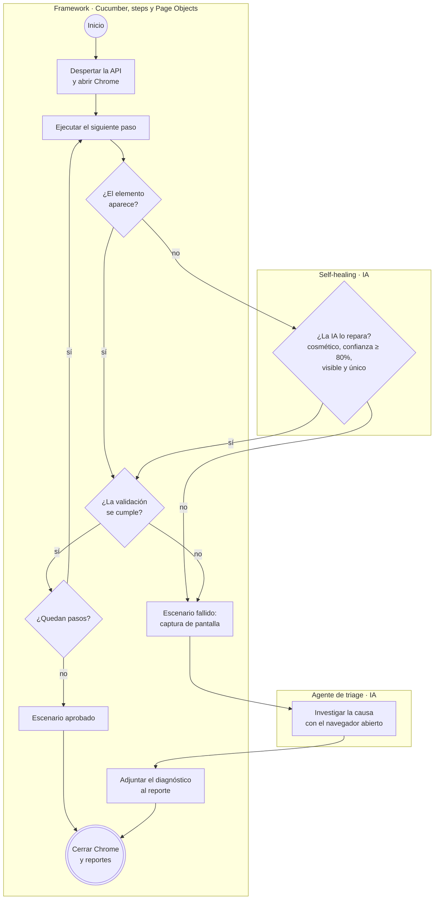
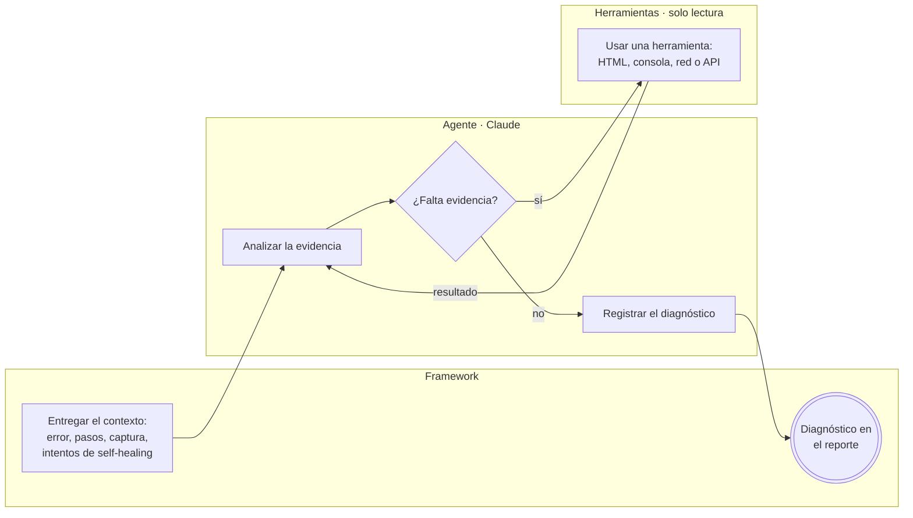
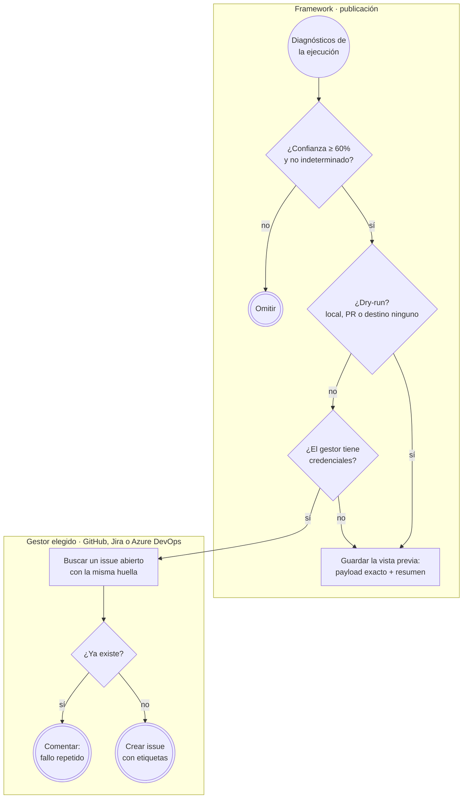
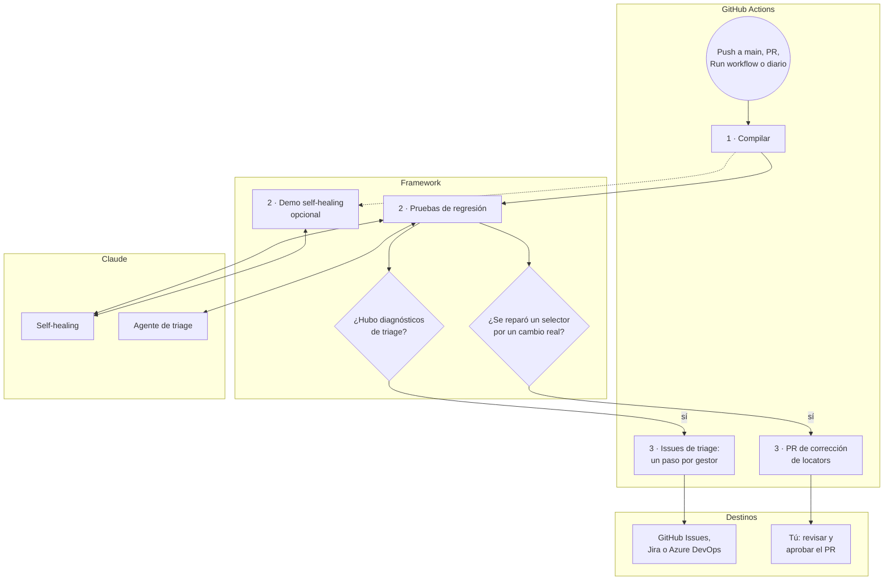

# Guzmán Corretaje — Automatización E2E con Agentes de IA

> **Rama `feature/agentes-ia`** · Todo lo de [`feature/self-healing-ia`](https://github.com/pgp-qa-automation-labs/poc-selenium-cucumber/tree/feature/self-healing-ia) + un **agente de triage**: cuando una prueba falla, un agente de IA investiga la causa por su cuenta, entrega un diagnóstico y crea un issue en **GitHub, Jira o Azure DevOps**.

## ¿Qué hace esta rama?

Cuando una prueba automatizada falla, alguien tiene que abrir el reporte, mirar la captura y adivinar si es un bug, si el servidor estaba caído o si el problema está en la propia prueba. Esta rama automatiza esa investigación:

1. **Mientras corre la prueba:** si un elemento cambió de nombre, el **self-healing** lo repara con IA y la prueba continúa (igual que en `feature/self-healing-ia`).
2. **Si la prueba falla igual:** con el navegador todavía abierto en el momento del error, un **agente de triage** investiga. Mira la captura, revisa el HTML, la consola y las llamadas de red del navegador, consulta la API y decide qué más revisar hasta llegar a una conclusión.
3. **El agente entrega un diagnóstico:** categoría (bug, ambiente caído, cambio de la interfaz...), severidad, área responsable, causa probable con evidencias y acción recomendada.
4. **El pipeline publica el diagnóstico** como issue en el gestor que elijas, sin duplicar fallos repetidos.

Además, el escenario principal valida que **la conversión del precio a pesos use la UF del día** correctamente.

## Ramas del repositorio

| Rama | Qué agrega | IA |
|---|---|---|
| [`main`](https://github.com/pgp-qa-automation-labs/poc-selenium-cucumber/tree/main) | Automatización base: Selenium + Cucumber + TestNG con Page Object Model | No |
| [`feature/self-healing-ia`](https://github.com/pgp-qa-automation-labs/poc-selenium-cucumber/tree/feature/self-healing-ia) | **Self-healing:** si un elemento cambia, la IA lo encuentra, la prueba continúa y se propone un PR que corrige el código | Sí (consulta directa) |
| **`feature/agentes-ia`** (esta) | **Agente de triage:** cuando una prueba falla, un agente investiga la causa y crea un issue en GitHub, Jira o Azure DevOps | Sí (agente) |
| [`demo/locator-obsoleto`](https://github.com/pgp-qa-automation-labs/poc-selenium-cucumber/tree/demo/locator-obsoleto) | Rama de demostración del PR automático del self-healing | — |

## ¿Dónde están los agentes?

No son un servicio aparte: son **código Java dentro de esta rama** que, durante la ejecución de las pruebas, llama a la API de Claude.

| Pieza | Dónde está | Qué es |
|---|---|---|
| Agente de triage | [`src/main/java/.../triage/TriageAgent.java`](src/main/java/cl/guzman/automation/triage/TriageAgent.java) | El agente: recibe el fallo, decide qué herramientas usar y registra el diagnóstico |
| Herramientas del agente | [`src/main/java/.../triage/`](src/main/java/cl/guzman/automation/triage/) (`LeerHtml`, `LeerConsola`, `LeerRed`, `ConsultarApi`, `RegistrarDiagnostico`) | Lo único que el agente puede hacer: todas son de **solo lectura** |
| Self-healing (no es agente) | [`src/main/java/.../healing/`](src/main/java/cl/guzman/automation/healing/) | Una consulta directa a la IA por cada selector roto |
| Publicación de issues | [`src/main/java/.../issues/`](src/main/java/cl/guzman/automation/issues/) | Conectores de GitHub, Jira y Azure DevOps |

## Cómo funciona

### 1. Flujo completo de la prueba



- **Si todo funciona, no se consulta a la IA:** ni self-healing ni triage, así que no hay costo.
- **El self-healing actúa durante la prueba** para que un cambio cosmético no la detenga. **El triage actúa después de un fallo** para explicar por qué ocurrió.
- **Ni el self-healing ni el agente deciden si la prueba pasa o falla.** Esa decisión es siempre de las validaciones del framework.

### 2. Cómo investiga el agente de triage

A diferencia del self-healing (una pregunta y una respuesta), el agente **decide por su cuenta** qué revisar, en varias vueltas (máximo 8), hasta tener evidencia suficiente.



**Qué evalúa con cada herramienta:**

| Herramienta | Qué revisa | Qué le permite concluir |
|---|---|---|
| Captura (siempre incluida) | Lo que veía el usuario al fallar | Qué falta o qué se ve mal en pantalla |
| `LeerHtml` | El HTML visible actual | Si un elemento existe, está oculto o cambió |
| `LeerConsola` | Errores de JavaScript del navegador | Si el front tuvo un error propio |
| `LeerRed` | Las llamadas del navegador a la API y lo que recibió **en ese momento** (200, 503, fallida) | Fallas intermitentes del backend que una consulta posterior ya no reproduce, y errores que el front oculta |
| `ConsultarApi` | Un `GET` a la API ahora (solo rutas `/api/...`) | Si el backend responde **ahora**, para contrastarlo con lo que vio el navegador |
| `RegistrarDiagnostico` | — | Cierra la investigación con el diagnóstico |

**Qué entrega (el diagnóstico):**

| Campo | Valores |
|---|---|
| Categoría | `BUG_APLICACION`, `AMBIENTE_NO_DISPONIBLE`, `CAMBIO_FUNCIONAL_UI`, `DATOS_DE_PRUEBA`, `PROBLEMA_DEL_TEST`, `INDETERMINADO` |
| Severidad | `ALTA` (bloquea un flujo para usuarios reales), `MEDIA`, `BAJA` (solo afecta la automatización) |
| Área responsable | `FRONTEND`, `BACKEND`, `INFRAESTRUCTURA`, `QA` |
| Además | Título, causa probable, evidencias concretas, acción recomendada y confianza (0 a 100) |

En el log del pipeline, cada investigación aparece como una sección plegable con cada herramienta que usó el agente:

```
▸ 🔎 Triage IA: Revisar el precio en pesos de un departamento en venta en Ñuñoa
    Herramienta 1: LeerRed → 6 peticiones de datos, 4 con error
    Herramienta 2: LeerConsola → 0 mensajes, 0 errores
    Herramienta 3: ConsultarApi → GET /api/uf -> HTTP 200 en 219 ms
    Herramienta 4: RegistrarDiagnostico → AMBIENTE_NO_DISPONIBLE · MEDIA · INFRAESTRUCTURA (70%)
```

### 3. Cómo se publican los issues



- **Huella:** escenario + paso + categoría + ambiente. Si la ejecución diaria detecta el mismo fallo cinco días seguidos, verás **un** issue con cinco comentarios.
- **Los tres gestores reciben los mismos datos**, cada uno en su formato: markdown en GitHub, ADF en Jira y HTML con severidad en Azure DevOps.
- **Qué se envía:** título, severidad, categoría, área, confianza, causa, evidencias, acción recomendada, escenario, paso, URL, ambiente, rama/commit y enlace a la ejecución. **No se envía:** la captura, el HTML, la consola ni ningún secreto (la captura queda en los artefactos de la ejecución enlazada).

### 4. Flujo del pipeline (GitHub Actions)



- **Las pruebas solo prueban y diagnostican**, con permisos de lectura. Cada etapa 3 es la única que puede escribir: una abre PRs y la otra crea issues.
- **`3 · Issues de triage` corre aunque la regresión falle**, porque es justo cuando hay diagnósticos. Tiene un paso por gestor; los no elegidos aparecen omitidos, y si un gestor falla los demás igual se ejecutan.
- **La demo de self-healing es opcional,** porque consume IA sin detectar problemas nuevos.

## Paso a paso para usarlo

### En tu computador
1. Sigue el paso a paso de [`main`](https://github.com/pgp-qa-automation-labs/poc-selenium-cucumber/tree/main#paso-a-paso-para-usarlo) (Java, Maven, Chrome, descargar el proyecto) y cambia a esta rama:
   ```bash
   git checkout feature/agentes-ia
   ```
2. **Configura la API key de Claude** como variable de entorno `ANTHROPIC_API_KEY` (detalle en [`feature/self-healing-ia`](https://github.com/pgp-qa-automation-labs/poc-selenium-cucumber/tree/feature/self-healing-ia#paso-a-paso-para-usarlo)). Sin ella, el self-healing y el triage se desactivan y las pruebas funcionan como en `main`.
3. **Ejecuta las pruebas normales.** Si todo pasa, no se consulta a la IA:
   ```bash
   mvn test
   ```
4. **Mira al agente investigar** con una demo que provoca un fallo a propósito, solo dentro de tu navegador:

   | Demo | Qué simula | Diagnóstico esperado |
   |---|---|---|
   | `mvn test -Dcucumber.filter.tags=@ui-rota` | El botón Buscar desaparece | `BUG_APLICACION` · Frontend |
   | `mvn test -Dcucumber.filter.tags=@api-caida` | El navegador no puede cargar las propiedades | `AMBIENTE_NO_DISPONIBLE` · Infraestructura |
   | `mvn test -Dcucumber.filter.tags=@uf-caida` | El navegador no puede obtener el valor de la UF | `AMBIENTE_NO_DISPONIBLE` · Infraestructura |

5. **Revisa el resultado:**
   - `target/cucumber-reports/cucumber.html`: el escenario fallido con la captura, el reporte de self-healing y el **diagnóstico del triage**.
   - `target/triage/triage-report.md`: todos los diagnósticos de la ejecución.
   - `target/issues/github/`: la **vista previa** del issue que se habría creado (en local nunca se publica).

### En GitHub
1. **Secreto de la IA:** *Settings → Secrets and variables → Actions → New repository secret* → `ANTHROPIC_API_KEY`.
2. **Permiso para crear PRs:** *Settings → Actions → General → Workflow permissions* → **Allow GitHub Actions to create and approve pull requests**.
3. **Ejecuta:** *Actions → E2E Selenium Cucumber → Run workflow* → rama **`feature/agentes-ia`**. Opciones:

   | Campo | Para qué | Ejemplo |
   |---|---|---|
   | Ambiente | `qa` o `prod` | `qa` |
   | Escenarios | Qué escenarios correr (tags de Cucumber) | `@ui-rota` para ver un issue de demo |
   | Destino de los issues | Dónde publicar si el triage diagnostica un fallo | `github`, `jira`, `azuredevops`, `todos` o `ninguno` (solo vista previa) |
   | Demo de self-healing | Ejecutar también la demo de reparaciones | desmarcado |

4. **Revisa el resultado:** el resumen de la ejecución muestra el diagnóstico, los issues creados con su enlace y el reporte de self-healing. En **Artifacts** están los reportes completos y las vistas previas de los issues.

### Conectar Jira y Azure DevOps
Sin configuración, esos pasos solo generan la vista previa, sin fallar. Para publicar de verdad, agrega en *Settings → Secrets and variables → Actions*:

| Gestor | Variables (pestaña *Variables*) | Secretos (pestaña *Secrets*) |
|---|---|---|
| Jira Cloud | `JIRA_BASE_URL` (ej. `https://miempresa.atlassian.net`), `JIRA_PROJECT_KEY` | `JIRA_EMAIL`, `JIRA_API_TOKEN` |
| Azure DevOps | `AZURE_DEVOPS_ORG_URL` (ej. `https://dev.azure.com/miempresa`), `AZURE_DEVOPS_PROJECT` | `AZURE_DEVOPS_PAT` (permiso Work Items: lectura y escritura) |

Para cambiar el destino de las ejecuciones automáticas (por defecto `github`), crea la variable `ISSUES_DESTINO`.

## Configuración

Además de la configuración de las ramas anteriores, en `config.json`:

| Sección | Claves principales |
|---|---|
| `triage` | `enabled`, `model` (`claude-sonnet-5-5`), `maxIterations` (8), `requestTimeoutSeconds` |
| `issues` | `enabled`, `tracker` (`github`, `jira`, `azuredevops`), `dryRun` (`true` en local), `minConfidence` (60), datos de cada gestor |

## Costos aproximados (Claude Sonnet 5.5)

| Situación | Consultas a la IA | Costo aprox. |
|---|---|---|
| Todas las pruebas pasan y nada cambió | Ninguna | USD 0 |
| Un selector cambia y se repara | 1 por selector | ≈ USD 0,02 |
| Una prueba falla y el agente la investiga | 3 a 6 vueltas | ≈ USD 0,10 |

El consumo real se ve en la [Claude Console](https://platform.claude.com/) → *Usage* / *Cost*, y cada reporte indica los tokens usados.

## Estructura

```
src/main/java/cl/guzman/automation/
├── config/        ConfigReader y EnvironmentConfig
├── driver/        DriverFactory y DriverManager (consola y red del navegador habilitadas para el triage)
├── healing/       Self-healing: Locator, HealingEngine, ClaudeLocatorAdvisor, DomSnapshot, HealingReport, LocatorPatcher
├── triage/        Agente: TriageAgent, herramientas (LeerHtml, LeerConsola, LeerRed, ConsultarApi, RegistrarDiagnostico), Diagnostico, TriageReport
├── issues/        IssueTracker y conectores (GitHub, Jira, Azure DevOps), ContenidoIssue, IssuePublisher, PublicarIssues
├── pages/         BasePage, HomePage, ResultadosPage, DetallePropiedadPage
├── components/    TarjetaPropiedad
├── model/         Propiedad
└── utils/         TextUtils, ScreenshotUtils, WarmUpUtils, CiLog

src/test/java/cl/guzman/automation/
├── context/       TestContext (estado compartido entre steps, vía PicoContainer)
├── hooks/         Hooks (despertar API, navegador, simulaciones, triage al fallar, reportes)
├── listeners/     PasosListener (pasos y error de cada escenario, para el triage)
├── runners/       TestRunner (TestNG)
├── simulation/    UiChangeSimulator (cambios de UI y caídas simuladas para las demos)
└── steps/         NavegacionSteps, BusquedaPropiedadSteps, DetallePropiedadSteps

src/test/resources/features/   escenarios Gherkin (palabras clave en inglés, pasos en español)
```

## Notas
- La ejecución diaria programada (`schedule`) de GitHub Actions solo se activa desde la rama principal del repo; en esta rama el pipeline corre con push a `main`, en PRs y a mano.
- El repositorio es público: los issues creados en GitHub también lo son.
- Si tienes un `chromedriver.exe` antiguo en el PATH, Maven lo ignora (`SE_SKIP_DRIVER_IN_PATH=true` en el `pom.xml`).
