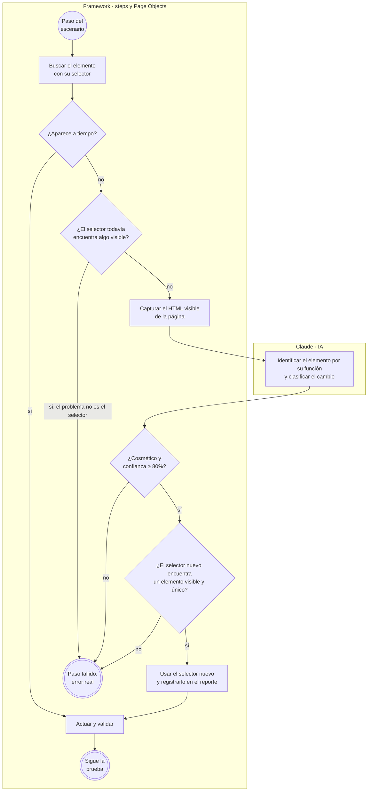
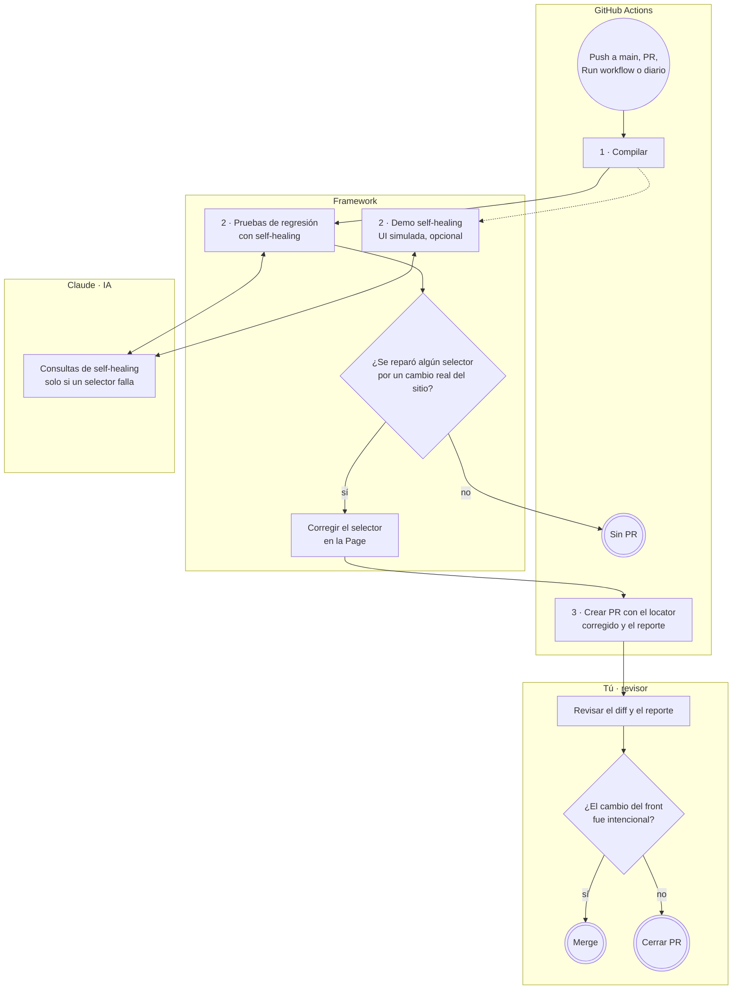

# Guzmán Corretaje — Automatización E2E con Self-healing (IA)

> **Rama `feature/self-healing-ia`** · La automatización base de `main` + **self-healing con IA**: cuando un elemento de la página cambia de nombre o estructura, la IA lo encuentra, la prueba continúa y el pipeline propone un PR que corrige el código.

## ¿Qué hace esta rama?

Las pruebas automatizadas encuentran los elementos de la página (botones, listas, textos) por su **selector**, por ejemplo la clase CSS `buscador-hero__btn`. Si el equipo de front renombra esa clase, la prueba falla aunque el sitio funcione perfecto. Es el problema más común y costoso de mantener en la automatización.

Esta rama lo resuelve así:

1. Si un selector deja de funcionar, el framework le muestra a la IA (Claude) **el HTML actual de la página** y **para qué sirve** el elemento ("Botón BUSCAR del buscador principal").
2. La IA lo identifica y decide si el cambio es **cosmético** (solo cambió el nombre: el flujo sigue intacto) o **funcional** (el elemento desapareció o cambió su propósito).
3. Si es cosmético y el navegador confirma el selector nuevo, **la prueba continúa**. Si es funcional, **la prueba falla**, como debe: la IA nunca oculta un error real.
4. Al terminar, si hubo reparaciones por cambios reales del sitio, el pipeline **abre un Pull Request** que corrige el selector en el código, para que una persona lo apruebe.

## Ramas del repositorio

| Rama | Qué agrega | IA |
|---|---|---|
| [`main`](https://github.com/pgp-qa-automation-labs/poc-selenium-cucumber/tree/main) | Automatización base: Selenium + Cucumber + TestNG con Page Object Model | No |
| **`feature/self-healing-ia`** (esta) | **Self-healing:** si un elemento cambia, la IA lo encuentra, la prueba continúa y se propone un PR que corrige el código | Sí (consulta directa) |
| [`feature/agentes-ia`](https://github.com/pgp-qa-automation-labs/poc-selenium-cucumber/tree/feature/agentes-ia) | **Agente de triage:** cuando una prueba falla, un agente investiga la causa y crea un issue en GitHub, Jira o Azure DevOps | Sí (agente) |
| [`demo/locator-obsoleto`](https://github.com/pgp-qa-automation-labs/poc-selenium-cucumber/tree/demo/locator-obsoleto) | Rama de demostración del PR automático: tiene un selector obsoleto a propósito | — |

## Cómo funciona

### 1. Flujo de la prueba con self-healing

Cada vez que la prueba necesita un elemento de la página ocurre esto. El camino de la izquierda (el selector funciona) es el normal y **no consulta a la IA**: no tiene costo.



Hay **tres filtros** antes de aceptar una reparación, y todos los aplica el framework, no la IA:

| Filtro | Qué evita |
|---|---|
| **¿El selector todavía encuentra algo?** | Reparar cuando el elemento sí está, pero falla otra cosa (por ejemplo, un selector sin opciones porque el backend no respondió) |
| **¿Cosmético y confianza ≥ 80%?** | Aceptar cambios funcionales o respuestas dudosas de la IA |
| **¿Visible y único en el navegador?** | Usar un selector que la IA "inventó" o que apunta a otro elemento |

### 2. Qué recibe y qué responde la IA

El self-healing hace **una consulta directa** a la IA (no es un agente: no toma decisiones por su cuenta ni usa herramientas).

| La IA recibe | La IA responde (JSON validado) |
|---|---|
| El selector que dejó de funcionar | **Tipo de cambio:** `COSMETICO`, `FUNCIONAL` o `NO_ENCONTRADO` |
| La descripción del elemento (*"Botón BUSCAR del buscador principal"*) | **Selector nuevo** (CSS o XPath), solo si es cosmético |
| El HTML visible de la página, reducido (sin scripts, estilos ni imágenes; los elementos ocultos van marcados) | **Confianza** de 0 a 100 |
| Si apunta a uno o a varios elementos (un listado) | **Razón** en español, que queda en el reporte |

Ejemplo real de una reparación: *"El botón BUSCAR sigue presente y visible dentro de la barra del buscador con el mismo texto y función; solo cambió su clase de `buscador-hero__btn` a `hero-search__submit`."* Cada consulta usa unos 11.000 tokens (≈ USD 0,02 con Claude Sonnet 5.5).

### 3. Flujo del pipeline y del PR automático



- **Regresión y demo corren en paralelo** porque son independientes. La demo altera la página a propósito para mostrar el self-healing; por eso está separada, **nunca corrige código** y solo corre si la pides.
- **El PR nunca se mergea solo:** apunta a la rama donde corrió el pipeline y lo revisa una persona.

## Paso a paso para usarlo

### En tu computador
1. Sigue el paso a paso de [`main`](https://github.com/pgp-qa-automation-labs/poc-selenium-cucumber/tree/main#paso-a-paso-para-usarlo) para instalar Java, Maven y Chrome, y descargar el proyecto. Luego cambia a esta rama:
   ```bash
   git checkout feature/self-healing-ia
   ```
2. **Crea una API key** en la [Claude Console](https://platform.claude.com/) (te recomendamos un *workspace* propio con límite de gasto) y guárdala como variable de entorno. En Windows: *Editar las variables de entorno de esta cuenta* → nueva variable `ANTHROPIC_API_KEY`. En macOS/Linux: `export ANTHROPIC_API_KEY=...`. **Sin la key, el self-healing se desactiva** y las pruebas funcionan como en `main`.
3. **Ejecuta las pruebas normales** (no consultan a la IA si nada cambió):
   ```bash
   mvn test
   ```
4. **Ve el self-healing en acción** con la demo, que renombra 4 clases CSS del sitio solo dentro de tu navegador:
   ```bash
   mvn test -Dcucumber.filter.tags=@ui-cambiada
   ```
   La prueba pasa y en el reporte (`target/cucumber-reports/cucumber.html`) verás cada reparación con su razón. También queda en `target/healing/healing-report.md`.
5. **Comprueba que no oculta errores reales:** esta demo esconde el botón Buscar y la prueba **debe fallar**:
   ```bash
   mvn test -Dcucumber.filter.tags=@ui-rota
   ```

### En GitHub
1. **Agrega la API key como secreto:** *Settings → Secrets and variables → Actions → New repository secret* → nombre `ANTHROPIC_API_KEY`.
2. **Permite que el pipeline cree PRs:** *Settings → Actions → General → Workflow permissions* → marca **Allow GitHub Actions to create and approve pull requests** (si el repo es de una organización, actívalo primero en la organización).
3. **Ejecuta:** *Actions → E2E Selenium Cucumber → Run workflow* → elige la rama `feature/self-healing-ia`. Marca **Ejecutar también la demo de self-healing** si quieres ver las reparaciones.
4. **Revisa el resultado:** en el resumen de la ejecución aparece el reporte de self-healing.
5. **Para ver el PR automático,** ejecuta el workflow sobre la rama [`demo/locator-obsoleto`](https://github.com/pgp-qa-automation-labs/poc-selenium-cucumber/tree/demo/locator-obsoleto): tiene un selector viejo a propósito, el self-healing lo repara y la etapa 3 abre un PR con la corrección.

## Configuración

Además de la configuración de `main`, en `config.json` → `healing`:

| Clave | Valor por defecto | Para qué |
|---|---|---|
| `enabled` | `true` | Activa el self-healing (además requiere `ANTHROPIC_API_KEY`) |
| `model` | `claude-sonnet-5-5` | Modelo de Claude |
| `minConfidence` | `80` | Confianza mínima para aceptar una reparación |
| `maxDomChars` | `150000` | Tamaño máximo del HTML enviado |
| `patchSources` | `false` | Corregir el código al final (el pipeline lo activa) |

Cualquier valor se puede cambiar al ejecutar: `mvn test -Dhealing.minConfidence=90`.

### Escenarios de demostración

Simulan cambios del front **sin tocar el sitio real**: se inyecta un script en el navegador de la prueba (Chrome DevTools Protocol).

| Tag | Simulación | Resultado esperado |
|---|---|---|
| `@ui-cambiada` | Renombra 4 clases CSS (botón Buscar, título del listado, título y dirección del detalle) | ✅ La IA repara los 4 selectores y la prueba pasa |
| `@ui-rota` (`@manual`) | Oculta el botón Buscar | ❌ La IA lo clasifica como `NO_ENCONTRADO` y la prueba falla |

## Estructura

```
src/main/java/cl/guzman/automation/
├── config/        ConfigReader y EnvironmentConfig
├── driver/        DriverFactory y DriverManager (un navegador por hilo)
├── healing/       Locator, HealingEngine, ClaudeLocatorAdvisor, DomSnapshot, HealingReport, LocatorPatcher
├── pages/         BasePage (aquí se conecta el self-healing), HomePage, ResultadosPage, DetallePropiedadPage
├── components/    TarjetaPropiedad
├── model/         Propiedad
└── utils/         TextUtils, ScreenshotUtils, WarmUpUtils

src/test/java/cl/guzman/automation/
├── context/       TestContext (estado compartido entre steps, vía PicoContainer)
├── hooks/         Hooks (despertar API, navegador, captura al fallar, simulaciones, reportes)
├── runners/       TestRunner (TestNG)
├── simulation/    UiChangeSimulator (cambios de UI simulados para las demos)
└── steps/         NavegacionSteps, BusquedaPropiedadSteps, DetallePropiedadSteps

src/test/resources/features/   escenarios Gherkin (palabras clave en inglés, pasos en español)
```

## Notas
- La ejecución diaria programada (`schedule`) de GitHub Actions solo se activa desde la rama principal del repo; en esta rama el pipeline corre con push a `main`, en PRs y a mano.
- Si tienes un `chromedriver.exe` antiguo en el PATH, Maven lo ignora (`SE_SKIP_DRIVER_IN_PATH=true` en el `pom.xml`).
