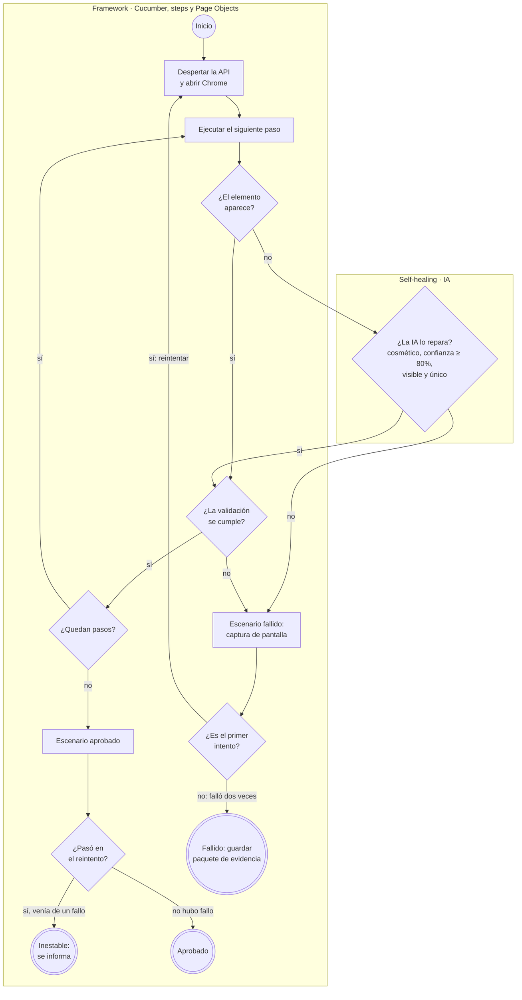
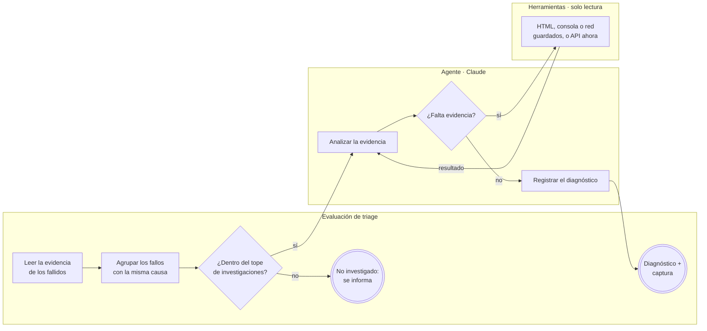
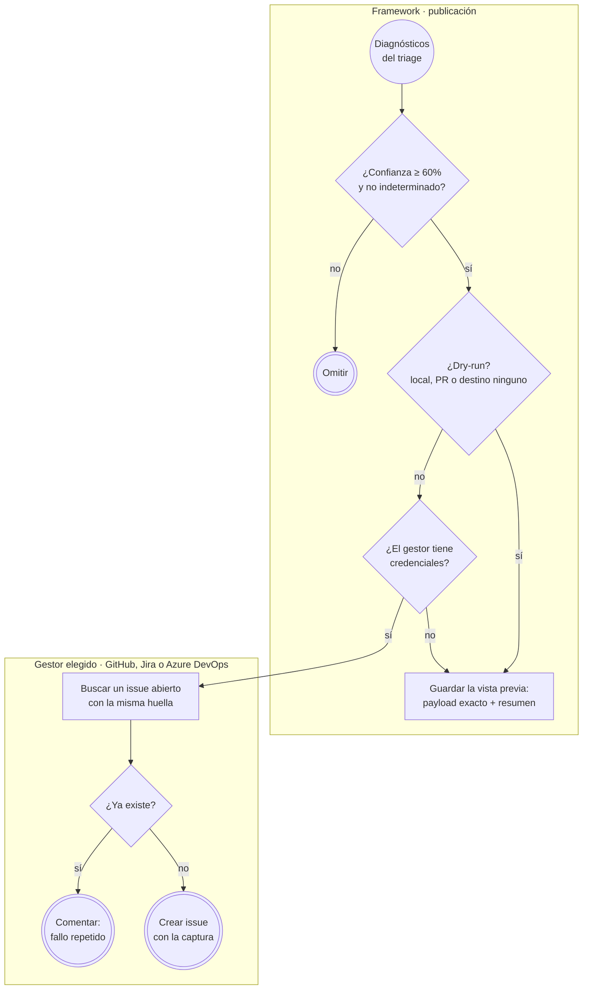
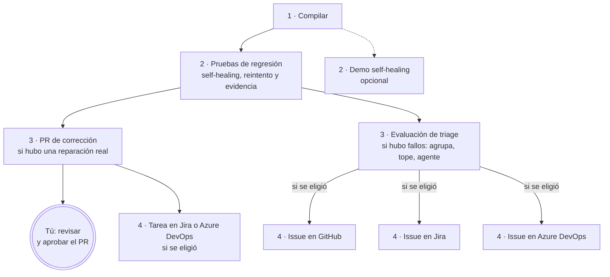

# Guzmán Corretaje — Automatización E2E con Agentes de IA

> **Rama `feature/agentes-ia`** · Todo lo de [`feature/self-healing-ia`](https://github.com/pgp-qa-automation-labs/poc-selenium-cucumber/tree/feature/self-healing-ia) + un **agente de triage**: cuando una prueba falla, un agente de IA investiga la causa, entrega un diagnóstico y crea un issue con la captura en **GitHub, Jira o Azure DevOps**.

## ¿Qué hace esta rama?

Cuando una prueba automatizada falla, alguien tiene que abrir el reporte, mirar la captura y adivinar si es un bug, si el servidor estaba caído o si el problema está en la propia prueba. Esta rama automatiza esa investigación, en pasos separados:

1. **Probar.** Si un elemento cambió de nombre, el **self-healing** lo repara con IA y la prueba continúa. Si un escenario falla, **se reintenta una vez**: si en el reintento pasa, es un fallo **inestable** (se informa, pero no se investiga). Si vuelve a fallar, se guarda un **paquete de evidencia** con la captura, el HTML, la consola y las llamadas de red del navegador.
2. **Diagnosticar.** Un **agente de triage** investiga la evidencia: decide por su cuenta qué revisar hasta llegar a una conclusión. Si varios escenarios fallaron por la misma causa, se investiga **uno por grupo**, con un **tope** de investigaciones por ejecución.
3. **Informar.** El diagnóstico (categoría, severidad, área responsable, causa, evidencias y acción recomendada) se publica como **issue con la captura** en el gestor que elijas, sin duplicar fallos repetidos.

Además, el escenario principal valida que **la conversión del precio a pesos use la UF del día** correctamente.

## Ramas del repositorio

| Rama | Qué agrega | IA |
|---|---|---|
| [`main`](https://github.com/pgp-qa-automation-labs/poc-selenium-cucumber/tree/main) | Automatización base: Selenium + Cucumber + TestNG con Page Object Model | No |
| [`feature/self-healing-ia`](https://github.com/pgp-qa-automation-labs/poc-selenium-cucumber/tree/feature/self-healing-ia) | **Self-healing:** si un elemento cambia, la IA lo encuentra, la prueba continúa y se propone un PR que corrige el código | Sí (consulta directa) |
| **`feature/agentes-ia`** (esta) | **Agente de triage:** cuando una prueba falla, un agente investiga la causa y crea un issue en GitHub, Jira o Azure DevOps | Sí (agente) |
| [`demo/locator-obsoleto`](https://github.com/pgp-qa-automation-labs/poc-selenium-cucumber/tree/demo/locator-obsoleto) | Rama de demostración del PR automático del self-healing | — |
| `triage-evidencias` | Generada por el pipeline: guarda las capturas que muestran los issues de GitHub. No contiene código | — |

## ¿Dónde están los agentes?

No son un servicio aparte: son **código Java dentro de esta rama** que llama a la API de Claude.

| Pieza | Dónde está | Qué es |
|---|---|---|
| Agente de triage | [`triage/TriageAgent.java`](src/main/java/cl/guzman/automation/triage/TriageAgent.java) | El agente: recibe un fallo, decide qué herramientas usar y registra el diagnóstico |
| Herramientas del agente | [`triage/`](src/main/java/cl/guzman/automation/triage/) (`LeerHtml`, `LeerConsola`, `LeerRed`, `ConsultarApi`, `RegistrarDiagnostico`) | Lo único que el agente puede hacer: todas son de **solo lectura** |
| Evaluación de triage | [`triage/EvaluadorTriage.java`](src/main/java/cl/guzman/automation/triage/EvaluadorTriage.java) | Separa inestables, agrupa fallos, aplica el tope y llama al agente |
| Paquete de evidencia | [`evidencia/`](src/main/java/cl/guzman/automation/evidencia/) | Lo que se guarda al fallar y la agrupación de fallos con la misma causa |
| Self-healing (no es agente) | [`healing/`](src/main/java/cl/guzman/automation/healing/) | Una consulta directa a la IA por cada selector roto |
| Publicación de issues | [`issues/`](src/main/java/cl/guzman/automation/issues/) | Conectores de GitHub, Jira y Azure DevOps |

## Cómo funciona

### 1. Flujo de la prueba



- **Si todo funciona, no se consulta a la IA**, así que no hay costo.
- **El self-healing actúa durante la prueba** para que un cambio cosmético no la detenga.
- **El reintento separa lo inestable de lo consistente.** Una falla momentánea (un servidor que despierta, una dependencia lenta) no llega al agente ni crea issues.
- **La prueba no espera al agente:** guarda la evidencia y termina. El diagnóstico es un paso aparte, que puede repetirse sin volver a probar.

### 2. Cómo investiga el agente de triage

A diferencia del self-healing (una pregunta y una respuesta), el agente **decide por su cuenta** qué revisar, en varias vueltas (máximo 8), hasta tener evidencia suficiente.



**Agrupación sin IA:** dos fallos van al mismo grupo si el navegador tuvo **las mismas llamadas a la API con error** (por ejemplo, `/api/properties → 503`), o si fallaron **en el mismo paso con el mismo error**. Si el sitio se cae y fallan 20 escenarios, el agente investiga **uno** y el issue lista los 20.

**Qué evalúa con cada herramienta:**

| Herramienta | Qué revisa | Qué le permite concluir |
|---|---|---|
| Captura (siempre incluida) | Lo que veía el usuario al fallar | Qué falta o qué se ve mal en pantalla |
| `LeerHtml` | El HTML visible guardado al fallar | Si un elemento existía, estaba oculto o cambió |
| `LeerConsola` | La consola del navegador guardada al fallar | Si el front tuvo un error propio de JavaScript |
| `LeerRed` | Las llamadas del navegador a la API y lo que recibió **en ese momento** (200, 503, fallida) | Fallas del backend que una consulta posterior ya no reproduce, y errores que el front oculta |
| `ConsultarApi` | Un `GET` a la API ahora (solo rutas `/api/...`) | Si el backend responde **ahora**, para contrastarlo con lo que vio el navegador |
| `RegistrarDiagnostico` | — | Cierra la investigación con el diagnóstico |

**Qué entrega (el diagnóstico):**

| Campo | Valores |
|---|---|
| Categoría | `BUG_APLICACION`, `AMBIENTE_NO_DISPONIBLE`, `CAMBIO_FUNCIONAL_UI`, `DATOS_DE_PRUEBA`, `PROBLEMA_DEL_TEST`, `INDETERMINADO` |
| Severidad | `ALTA` (bloquea un flujo para usuarios reales), `MEDIA`, `BAJA` (solo afecta la automatización) |
| Área responsable | `FRONTEND`, `BACKEND`, `INFRAESTRUCTURA`, `QA` |
| Además | Título, causa probable, evidencias concretas, acción recomendada, confianza (0 a 100), escenarios afectados y captura |

En el log del pipeline, cada investigación es una sección plegable con cada herramienta que usó el agente:

```
▸ 🔎 Triage IA: Revisar el precio en pesos de un departamento en venta en Ñuñoa
    Herramienta 1: LeerRed → 6 peticiones de datos, 4 con error
    Herramienta 2: LeerConsola → 0 mensajes, 0 errores
    Herramienta 3: ConsultarApi → GET /api/uf -> HTTP 200 en 219 ms
    Herramienta 4: RegistrarDiagnostico → AMBIENTE_NO_DISPONIBLE · MEDIA · INFRAESTRUCTURA (70%)
```

### 3. Cómo se publican los issues



- **Huella:** se calcula a partir de la evidencia del grupo (la llamada que falló, o el paso y el error), **no de la clasificación de la IA**. Así, aunque el agente clasifique el mismo fallo de forma distinta otro día, se comenta el issue existente en vez de abrir otro.
- **La captura en cada gestor:** **Jira** y **Azure DevOps** la reciben como **archivo adjunto**. La API de issues de **GitHub** no acepta adjuntos: la captura se publica en la rama `triage-evidencias` y se muestra **dentro del issue** como imagen (ver [Rama de evidencias](#rama-de-evidencias)).
- **Qué se envía:** título, severidad, categoría, área, confianza, causa, evidencias, acción recomendada, escenarios afectados, paso, URL, ambiente, rama/commit, enlace a la ejecución y la captura. **No se envía:** el HTML, la consola ni ningún secreto.

### 4. Flujo del pipeline (GitHub Actions)



| Etapa | Cuándo corre | Usa IA | Puede escribir |
|---|---|---|---|
| 1 · Compilar | Siempre | No | No |
| 2 · Pruebas de regresión | Siempre | Solo si un selector falla (self-healing) | No |
| 2 · Demo self-healing | Solo si marcas la casilla al lanzar a mano | Sí | No |
| 3 · PR de corrección | Si el self-healing reparó un selector por un cambio real | No | Abre un PR |
| 3 · Evaluación de triage | Si algún escenario falló (aunque sea inestable) | Solo para fallos consistentes, hasta el tope | Sube las capturas a `triage-evidencias` |
| 4 · Issue en (gestor) | Si hubo diagnósticos; una etapa por gestor elegido | No | Crea o comenta issues |
| 4 · Tarea en (gestor) | Si se abrió el PR de corrección y se eligió Jira o Azure DevOps | No | Crea o comenta una tarea de mantenimiento |

- **Cada etapa se comunica con la siguiente mediante archivos** (el paquete de evidencia y `triage-report.json`). Por eso se puede cambiar el prompt del agente, agregar un gestor o reprocesar evidencia sin tocar las pruebas.
- **Las etapas 4 corren en paralelo,** y si una falla, las demás siguen. Las que no elegiste no aparecen.

### Tareas de mantenimiento por reparaciones del self-healing

Cuando el self-healing repara un locator por un cambio **real** del sitio, la prueba pasa y se abre un PR que corrige el código. No es un bug (la aplicación funciona), sino **trabajo de mantenimiento para QA**:

| Destino | Qué se crea |
|---|---|
| GitHub | Nada adicional: el PR ya registra el trabajo |
| Jira / Azure DevOps | Una **tarea** (*Task*, no *Bug*) con etiquetas `self-healing`, `mantenimiento-test` y `area-qa`: el locator anterior y el nuevo, la razón y la confianza de la IA, el **enlace al PR** y una recomendación para el front (agregar un atributo estable como `data-testid` para que las pruebas no dependan de clases CSS) |

- **Sin duplicados:** la huella de la tarea es la página más el locator reparado; si la reparación se repite mientras el PR no se aprueba, se comenta la tarea existente.
- **Nunca por reparaciones simuladas** (las de las demos).
- El tipo de tarea es configurable: `issues.jiraTaskType` e `issues.azureTaskType` (por defecto `Task`).

### Rama de evidencias

La API de issues de GitHub solo acepta texto, pero un issue puede **mostrar** una imagen si tiene un enlace público. Por eso la etapa 3 guarda las capturas en una rama del mismo repo que funciona como carpeta de fotos: `triage-evidencias`. **No tiene código**, no comparte historial con las demás ramas y nunca se mezcla con ellas. La crea y la llena el pipeline.

```
triage-evidencias
├── README.md
└── 2026-10-06_run-11_feature-agentes-ia/                          ← fecha · número de run (el de la pestaña Actions) · rama
      ├── README.md                                                ← índice: enlace a la ejecución, commit y tabla de capturas
      └── ef20d432468a_buscar-departamentos-en-venta-en-nunoa.png  ← huella del fallo + escenario
```

- **Se acumula, no se sobrescribe:** cada issue apunta a la captura de su ejecución. Si se sobrescribiera, un issue antiguo mostraría la imagen de otro día.
- **Crecimiento:** cada fallo diagnosticado suma una imagen de 1 a 2 MB, y en git borrar archivos no reduce el tamaño (quedan en el historial). Para esta POC no es un problema. Si el volumen creciera, la mejora prevista es una **retención automática**: conservar solo las carpetas de los últimos 90 días (el mismo plazo en que GitHub borra los artefactos de cada ejecución) y recrear la rama sin historial en cada publicación. Las capturas más antiguas dejarían de verse en sus issues, pero el texto del diagnóstico se mantiene.

## Paso a paso para usarlo

### En tu computador
1. Sigue el paso a paso de [`main`](https://github.com/pgp-qa-automation-labs/poc-selenium-cucumber/tree/main#paso-a-paso-para-usarlo) (Java, Maven, Chrome, descargar el proyecto) y cambia a esta rama:
   ```bash
   git checkout feature/agentes-ia
   ```
2. **Configura la API key de Claude** como variable de entorno `ANTHROPIC_API_KEY` (detalle en [`feature/self-healing-ia`](https://github.com/pgp-qa-automation-labs/poc-selenium-cucumber/tree/feature/self-healing-ia#paso-a-paso-para-usarlo)). Sin ella, el self-healing y el triage se desactivan; la evidencia se guarda igual.
3. **Ejecuta las pruebas normales.** Si todo pasa, no se consulta a la IA:
   ```bash
   mvn test
   ```
   En local, al terminar `mvn test` se ejecutan solos el triage y la vista previa de los issues (nunca se publica nada).
4. **Prueba las demos**, que provocan fallos a propósito solo dentro de tu navegador:

   | Demo | Qué simula | Resultado esperado |
   |---|---|---|
   | `mvn test -Dcucumber.filter.tags=@ui-rota` | El botón Buscar desaparece | Falla dos veces → triage: `BUG_APLICACION` o `CAMBIO_FUNCIONAL_UI` · Frontend |
   | `mvn test -Dcucumber.filter.tags=@api-caida` | El navegador no puede cargar las propiedades | Falla dos veces → triage: `AMBIENTE_NO_DISPONIBLE` |
   | `mvn test -Dcucumber.filter.tags=@uf-caida` | El navegador no puede obtener el valor de la UF | Falla dos veces → triage: `AMBIENTE_NO_DISPONIBLE` |
   | `mvn test -Dcucumber.filter.tags=@intermitente` | La API falla solo en el primer intento | Pasa en el reintento → **inestable**, sin IA ni issue |

5. **Revisa el resultado:**
   - `target/cucumber-reports/cucumber.html`: los escenarios con sus intentos y capturas.
   - `target/evidencia/`: el paquete de evidencia de cada escenario fallido.
   - `target/triage/triage-report.md`: los diagnósticos, los inestables y lo no investigado.
   - `target/issues/github/`: la **vista previa** del issue que se habría creado.
6. **Reprocesa la evidencia sin volver a probar** (por ejemplo, después de ajustar el agente):
   ```bash
   mvn test-compile exec:java -Dexec.mainClass=cl.guzman.automation.triage.EvaluarTriage -Dexec.args=target/evidencia
   ```

### En GitHub
1. **Secreto de la IA:** *Settings → Secrets and variables → Actions → New repository secret* → `ANTHROPIC_API_KEY`.
2. **Permiso para crear PRs:** *Settings → Actions → General → Workflow permissions* → **Allow GitHub Actions to create and approve pull requests**.
3. **Ejecuta:** *Actions → E2E Selenium Cucumber → Run workflow* → rama **`feature/agentes-ia`**. Opciones:

   | Campo | Para qué | Ejemplo |
   |---|---|---|
   | Ambiente | `qa` o `prod` | `qa` |
   | Escenarios | Qué escenarios correr (tags de Cucumber) | `@ui-rota` para ver un issue de demo |
   | Destino de los issues | Dónde publicar si el triage diagnostica un fallo | `github`, `jira`, `azuredevops`, `todos` o `ninguno` (solo vista previa) |
   | Demo de self-healing | Ejecutar también la demo de reparaciones | desmarcado |

4. **Revisa el resultado:** el resumen de la etapa 3 muestra el diagnóstico **con la captura**, y el de cada etapa 4 el enlace al issue. En **Artifacts** están la evidencia, los reportes y las vistas previas.

### Conectar Jira y Azure DevOps
Sin configuración, esas etapas solo generan la vista previa, sin fallar. Para publicar de verdad, agrega en *Settings → Secrets and variables → Actions*:

| Gestor | Variables (pestaña *Variables*) | Secretos (pestaña *Secrets*) |
|---|---|---|
| Jira Cloud | `JIRA_BASE_URL` (ej. `https://miempresa.atlassian.net`), `JIRA_PROJECT_KEY` | `JIRA_EMAIL`, `JIRA_API_TOKEN` |
| Azure DevOps | `AZURE_DEVOPS_ORG_URL` (ej. `https://dev.azure.com/miempresa`), `AZURE_DEVOPS_PROJECT` | `AZURE_DEVOPS_PAT` (permiso Work Items: lectura y escritura) |

Para cambiar el destino de las ejecuciones automáticas (por defecto `github`), crea la variable `ISSUES_DESTINO`.

## Configuración

Además de la configuración de las ramas anteriores, en `config.json`:

| Sección | Claves principales |
|---|---|
| `retry` | `maxRetries` (1): reintentos antes de considerar un fallo consistente |
| `triage` | `enabled`, `model` (`claude-sonnet-5-5`), `maxIterations` (8 vueltas por investigación), `maxInvestigaciones` (5 por ejecución) |
| `issues` | `enabled`, `tracker` (`github`, `jira`, `azuredevops`), `dryRun` (`true` en local), `minConfidence` (60), datos de cada gestor |

## Costos aproximados (Claude Sonnet 5.5)

| Situación | Consultas a la IA | Costo aprox. |
|---|---|---|
| Todas las pruebas pasan | Ninguna | USD 0 |
| Un selector cambia y se repara | 1 por selector | ≈ USD 0,02 |
| Un escenario falla solo una vez (inestable) | Ninguna | USD 0 |
| Un escenario falla de forma consistente | 1 investigación (3 a 6 vueltas) | ≈ USD 0,10 |
| Muchos escenarios fallan por la misma causa | 1 investigación por grupo | ≈ USD 0,10 por grupo |
| **Máximo por ejecución** | Tope de 5 investigaciones | **≈ USD 0,50** |

El consumo real se ve en la [Claude Console](https://platform.claude.com/) → *Usage* / *Cost*, y cada reporte indica los tokens usados. Las etapas extra del pipeline no consumen IA, y en repositorios públicos los minutos de GitHub Actions son gratuitos.

## Estructura

```
src/main/java/cl/guzman/automation/
├── config/        ConfigReader y EnvironmentConfig
├── driver/        DriverFactory y DriverManager (consola y red del navegador habilitadas)
├── evidencia/     PaqueteEvidencia, RecolectorEvidencia, AgrupadorFallos
├── healing/       Self-healing: Locator, HealingEngine, ClaudeLocatorAdvisor, DomSnapshot, HealingReport, LocatorPatcher
├── triage/        TriageAgent y sus herramientas, EvaluadorTriage, EvaluarTriage, Diagnostico, TriageReport
├── issues/        IssueTracker y conectores (GitHub, Jira, Azure DevOps), ContenidoIssue, IssuePublisher, PublicarIssues,
│                  TareaReparacion y PublicarTareas (tareas de mantenimiento por reparaciones del self-healing)
├── pages/         BasePage, HomePage, ResultadosPage, DetallePropiedadPage
├── components/    TarjetaPropiedad
├── model/         Propiedad
└── utils/         TextUtils, ScreenshotUtils, WarmUpUtils, CiLog

src/test/java/cl/guzman/automation/
├── context/       TestContext (estado compartido entre steps, vía PicoContainer)
├── hooks/         Hooks (navegador, simulaciones, evidencia al fallar, triage al finalizar en local)
├── listeners/     PasosListener (pasos y error de cada escenario)
├── retry/         ReintentoFallidos y ReintentoTransformer (reintento de escenarios fallidos con TestNG)
├── runners/       TestRunner (TestNG)
├── simulation/    UiChangeSimulator (cambios de UI y caídas simuladas para las demos)
└── steps/         NavegacionSteps, BusquedaPropiedadSteps, DetallePropiedadSteps

.github/
├── actions/preparar-entorno/   Acción compuesta común (Java 17 + caché de Maven)
├── scripts/warmup.sh            Despierta la API leyendo el JSON del ambiente
├── scripts/publicar-evidencias.sh   Sube las capturas a la rama triage-evidencias con su índice
└── workflows/e2e.yml            Pipeline de 4 etapas
```

## Notas
- La ejecución diaria programada (`schedule`) de GitHub Actions solo se activa desde la rama principal del repo; en esta rama el pipeline corre con push a `main`, en PRs y a mano.
- El repositorio es público: los issues creados en GitHub y las capturas de `triage-evidencias` también lo son.
- Si tienes un `chromedriver.exe` antiguo en el PATH, Maven lo ignora (`SE_SKIP_DRIVER_IN_PATH=true` en el `pom.xml`).
